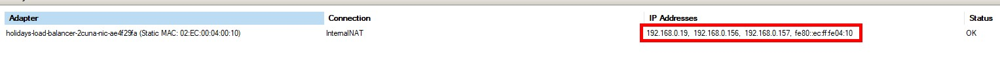

#### Introduction
In this article, we will investigate the functionality of the AKS Hybrid LoadBalancer, specifically focusing on the allocation of LoadBalancer-type services, the internal mechanisms of load balancing, and the reservation of external IP addresses. This comprehensive post aims to provide a clear understanding of the AKS Hybrid LoadBalancer's key components and their respective roles.

You have several options for creating an AKS Hybrid target cluster, including using the Windows Admin Center (WAC), PowerShell, Azure CLI, and Azure Portal. When utilizing the PowerShell functions of the AKS Hybrid module, you have the flexibility to modify the default settings as needed to customize the cluster according to your requirements. 


In the following command, we will create a target cluster featuring three HAProxy servers. The VM size of the load balancer will be configured with 4 CPUs and 6 GB of memory
```bash
$lbCfg New-AksHciLoadBalancerSetting -name "haProxyLB" -loadBalancerSku HAProxy -vmSize Standard_K8S3_v1 -loadBalancerCount 3
New-AksHciCluster -name "holidays" -nodePoolName "thanksgiving" -nodeCount 3 -OSType linux -nodeVmSize Standard_A4_v2 -loadBalancerSettings $lbCfg

```
The high-level illustration provided below presents the architecture of the AKS Hybrid target cluster, offering a  visual representation of the components and their relationships within the system, allowing for a better understanding of the overall structure for loadbalancing.
In the illustration, the green HAProxy server represents the active server, while the red HAProxy servers signify the passive ones


When you run the 'kubectl get pods' command or attempt to interact with your Kubernetes API server, the HAProxy server accepts the traffic and  routes the command to the appropriate control plane server. When you finish your installation, on a clean target cluster, there are two IP addresses assigned to your  loadbalancers!
The first IP address, 192.168.0.17 is assigned from the NodeIpPool, while the other IP address, 192.168.0.156, is assigned from the VIP Pool. This allocation method ensures that the IP addresses are appropriately distributed within the AKS Hybrid cluster


Kubernetes Services can be assigned an external IP address when they need to be accessible from outside the cluster, such as when providing a public-facing API, web application, or any other service that needs to be exposed to the internet or external networks.

A Kubernetes Service gets an external IP address when its type is set to  LoadBalancer. Here's a brief overview of these service types:

**LoadBalancer:** When a Service is configured as a LoadBalancer, an external load balancer is provisioned by the cloud provider or the on-premises infrastructure. The load balancer directs external traffic to the pods backing the service. The Service gets an external IP address, which is typically assigned by the  the external load balancer which in our case is HA Proxy Servers.

**NodePort:** In the case of a NodePort service, a specific port is opened on each node in the cluster, and traffic sent to that port is forwarded to the appropriate pods backing the service. While this type of service doesn't automatically get an external IP address, you can still access the service externally by using the IP address of any node in the cluster and the allocated NodePort. In some cases, you might set up an external load balancer or DNS to route traffic to the node IP addresses and NodePorts, effectively giving the service an external IP address. **In AKS Hybrid, we do not recommend deploying NodePort Services to avoid being affected by upgrades, node auto-healing, and the inherent node auto-scaling features.**

When you deploy a LoadBalancer type service in Kubernetes, a NodePort is opened by default as part of the process. This is because the LoadBalancer service is built on top of the NodePort service. The reason for this design choice is to provide a consistent way for traffic to be routed to the appropriate pods, regardless of whether the traffic originates from within the cluster or from an external source.

In a LoadBalancer type service, the external load balancer directs incoming traffic to the nodes in the cluster, which then forward the traffic to the appropriate pods via the NodePort. Essentially, the LoadBalancer acts as an entry point to the cluster, while the NodePort is responsible for routing the traffic within the cluster.

Let's go ahead and deploy a LoadBalancer type service in AKS Hybrid and take a closer look at its behavior.

```bash
kubectl apply -f https://raw.githubusercontent.com/Pamir/kubernetes-essentials/master/04-services/05-frontend-svc.yaml
```

```yaml
apiVersion: v1
kind: Service
metadata:
  labels:
    app: guestbook
    tier: frontend
  name: frontend
spec:
  ports:
  - port: 80
    protocol: TCP
    targetPort: 80
  selector:
    app: guestbook
    tier: frontend
  sessionAffinity: None
  type: LoadBalancer
```

When you deploy this service, you can use the command below to see that our frontend service receives an IP address from the VIP Pool.


And the Ip Address is assigned to the HA Proxy VMs as well.


So, what's really going on behind the scenes, and how does everything come together so smoothly. In the control plane of the AKS target cluster, there's a pod, as shown at the top of the diagram, which is responsible for monitoring any changes to LoadBalancer type service deployments. When the MOC Cloud Controller Manager detects any changes, it communicates them to the cloud agent. The cloud agent then reserves an IP address from the VIP Pool and sends a request to the lbagent running on every HAProxy server. The lbagent is responsible for updating the HAProxy service configuration file, and then it executes a reload command for HAProxy using systemctl reload-restart haproxy.


So far, we've covered the happy path for reserving IP addresses for LoadBalancer type services in AKS Hybrid. It's important to note that, for security reasons, all communication between these components is encrypted using certificates. If one of the certificates expires, the load balancer may not function as expected. As stated in Microsoft's official documentation on AKS Hybrid Cluster Certificates, it's necessary to periodically renew the internal components of AKS Hybrid certificates.

Additionally, there's one more parameter to consider: updating the lbagent certificates when they expire. This step is crucial to ensure that the entire system continues to function securely and effectively.That's great news! In the latest release, the certificate rotation process has been automated, so you no longer need to manually rotate the certificates. This improvement not only saves time and effort but also ensures that the security and functionality of the system are maintained without the risk of overlooking expired certificates. The automation of certificate rotation makes managing your AKS Hybrid cluster even more seamless and efficient. 

**Any way but if you need to execute Update-AksHciClusterCertificates  do not forget -patchLoadBalancer** Indeed, it might take some time to realize that something isn't working correctly, especially if the issue is related to expired certificates. You may only notice the problem when scaling your cluster or deploying a new LoadBalancer type service, as these operations require proper communication between components. If you deploy a service that receives an IP address from the VIP Pool and you still cannot access your application, it's possible that the issue is related to executing the Update-AksHciClusterCertificates command without the **patchLoadBalancer** parameter.

```bash
Update-AksHciClusterCertificates -Name holidays -fixCloudCredentials -patchLoadBalancer
```

!!  Happy troubleshooting !!!

