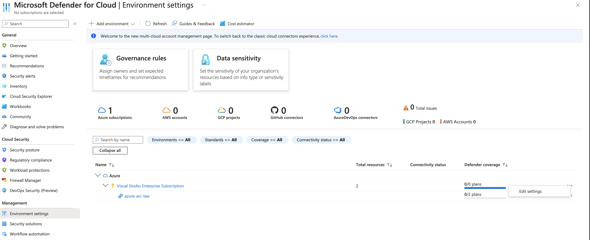
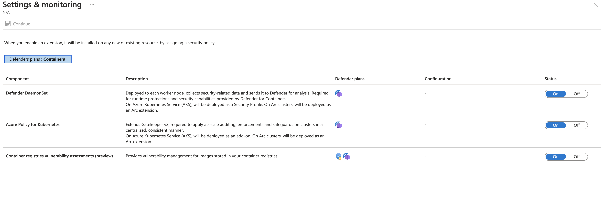
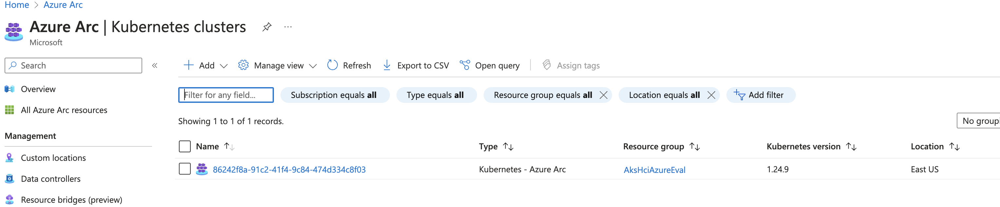
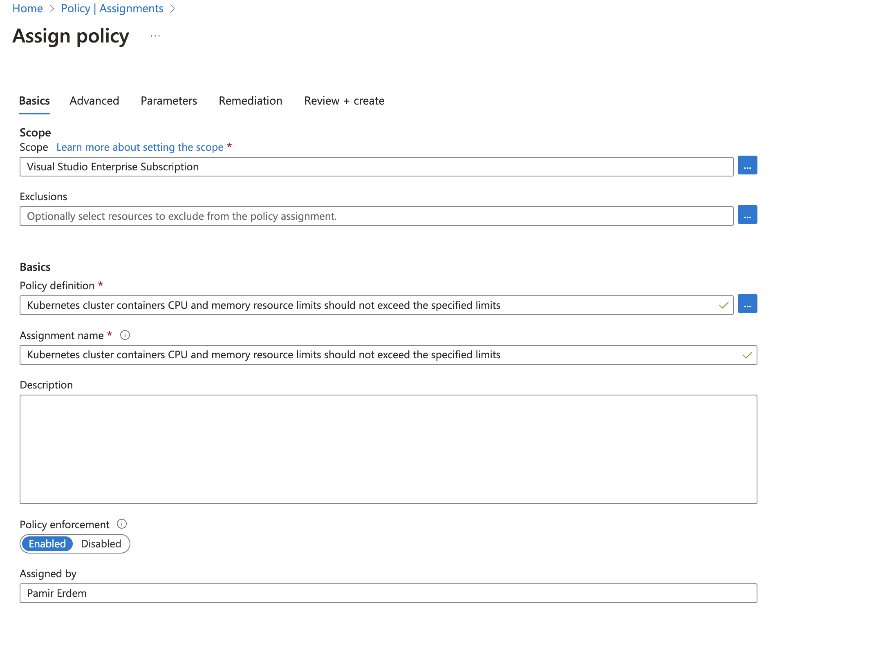
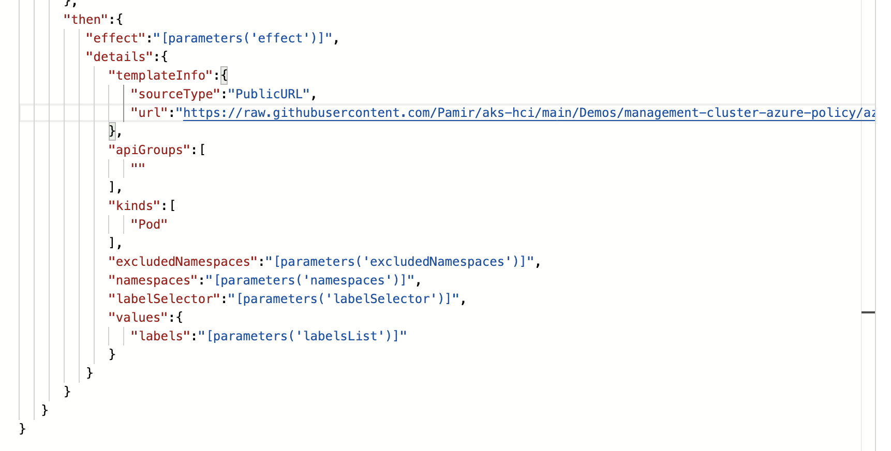

## Azure Policy Overview

Azure Policy is a service in Azure used for creating, assigning, and managing policies. These policies enforce different rules and effects over resources, ensuring compliance with corporate standards and service level agreements. Azure Policy evaluates Azure resources at or below the subscription-level, including Arc enabled resources. Some resource providers such as Machine configuration, Azure Kubernetes Service, and Azure Key Vault have a deeper integration for managing settings and objects [[1](https://learn.microsoft.com/en-us/azure/governance/policy/overview)].

### Azure Policy Guest Configuration (Now Azure Automanage Machine Configuration)

Azure Policy Guest Configuration, now known as Azure Automanage Machine Configuration, is a feature that can be used to audit the configuration settings in a virtual machine. It supports Azure VMs natively and non-Azure physical and virtual servers through Azure Arc-enabled servers. 

### Azure Policy for Kubernetes and Containers

Azure Policy for Kubernetes is a particular application of Azure Policy for the Kubernetes service in Azure. To apply a policy definition or initiative, the Azure portal is used. After navigating to the Azure Policy service in the Azure portal, users can select Definitions, choose the Kubernetes category, and then apply the desired policy definition or initiative [[2](https://github.com/MicrosoftDocs/azure-docs/blob/main/articles/aks/use-azure-policy.md)].

Azure Policy for Containers provides similar functionality but is focused on individual container instances. Both services ensure container-based applications conform to organizational and regulatory requirements.

### Azure Policy and Gatekeeper

Azure Policy has a relationship with Gatekeeper, an open-source project that enforces policies executed by the Open Policy Agent, a policy engine for Cloud Native environments. Azure Policy for Kubernetes is integrated with the Gatekeeper v3 project, enabling Kubernetes native policy enforcement.

### Azure Arc-Enabled Kubernetes

Azure Arc-enabled Kubernetes is a service that allows users to attach and configure Kubernetes clusters anywhere (inside or outside of Azure). It works in conjunction with Azure Policy for Containers to ensure policy compliance across all Kubernetes clusters, whether they're hosted in Azure, other cloud providers, or on-premises.

### Gatekeeper Policy

Gatekeeper is an implementation of the Open Policy Agent (OPA) specifically designed for Kubernetes. It functions as a validating admission webhook within the Kubernetes environment [[1](https://itnext.io/running-gatekeeper-in-kubernetes-and-writing-policies-part-1-fcc83eba93e3)].

Gatekeeper allows you to audit and enforce policies on Kubernetes resources. These policies are written in a language known as 'rego' and provide a means to ensure the consistency and security of your Kubernetes clusters [[1](https://itnext.io/running-gatekeeper-in-kubernetes-and-writing-policies-part-1-fcc83eba93e3)].

Beyond security, Gatekeeper has other administrative and operational uses, owing to its declarative policy enforcement. It can be used to manage a range of attributes and behaviors within your Kubernetes environment [[2](https://cloud.google.com/kubernetes-engine/docs/how-to/pod-security-policies-with-gatekeeper)].

The power of Gatekeeper lies in its flexibility and versatility. By defining custom policies, administrators can control various aspects of their Kubernetes resources, enhancing the overall governance and compliance of the system.

Azure Defender for Containers and Azure Policy for Containers both play a role in enforcing security and compliance in Kubernetes environments. Both services can deploy Gatekeeper policies to help manage and enforce specific rules within your Kubernetes clusters [[2](https://learn.microsoft.com/en-us/azure/defender-for-cloud/defender-for-containers-enable), [3](https://learn.microsoft.com/en-us/azure/defender-for-cloud/defender-for-containers-introduction)]. This alignment in functionalities ensures your containers remain secure and compliant with your organization's requirements.

### Audit and Deny Modes in Azure Policy

Azure Policy features various modes for policy enforcement, including Audit mode and Deny mode.

## Enabling Defender and Azure Policy for Containers


## Audit Mode

In Audit mode, Azure Policy checks for resource compliance with the policies in place but does not enforce them [[2](https://learn.microsoft.com/en-us/azure/governance/policy/concepts/effects)]. This means that if a resource does not comply with the policy, an entry is added to the activity log, marking the resource as non-compliant, but the policy does not block resource creation or modification [[3](https://techcommunity.microsoft.com/t5/itops-talk-blog/how-to-build-an-audit-azure-policy-with-multiple-parameters/ba-p/1866062)]. 

Audit mode is useful for understanding the potential impact of a policy before it's enforced. It helps identify resources that are currently non-compliant and understand how future resource deployments might be affected.


## Deny Mode

Deny mode is a stricter policy enforcement mode. In contrast to Audit mode, when a policy is in Deny mode, Azure Policy blocks any attempt to create or update a resource that would be non-compliant with the policy [[2](https://learn.microsoft.com/en-us/azure/governance/policy/concepts/effects)]. 

Deny mode helps maintain compliance by preventing non-compliant resources from being deployed. It is a crucial tool for maintaining consistent resource configurations and ensuring that all resources meet the necessary regulatory and organizational standards.


### AKS Hybrid Management Cluster and Gatekeeper Policies
In the context of Azure Kubernetes Service (AKS) Hybrid, a Management cluster, also referred to as the AKS host, is a central orchestration entity that provides an interface for deploying and managing one or more workload clusters [[1](https://learn.microsoft.com/en-us/azure/aks/hybrid/kubernetes-concepts)].

The Management cluster plays a pivotal role in AKS Hybrid, contributing to the deployment and management of containerized applications in Workload clusters, also known as target clusters [[1](https://learn.microsoft.com/en-us/azure/aks/hybrid/kubernetes-concepts)]. With AKS Hybrid, users can leverage Azure Arc to connect AKS clusters to Azure, enhancing visibility and management capabilities [[2](https://learn.microsoft.com/en-us/azure/aks/hybrid/aks-hybrid-options-overview)].


For billing purposes, Azure Arc-enabled Kubernetes is enabled by default on the management cluster.




### Azure Policy for Containers for Compliance


## Compliance Best Practices for Containers

- **Memory Limits and Requests:** It's crucial to specify memory requests and limits for containers to ensure efficient resource allocation and prevent any single container from exhausting the node's resources.

- **Default Namespace Deployment:** Deploying in the default namespace is not recommended. It's advisable to create specific namespaces for different workloads for better isolation, access control, and to avoid unintentional interactions.

- **Root Users:** Containers should not run as root users due to security risks. It's recommended to use a non-root user in the container image and specify a security context to enforce the principle of least privilege.

- **HostPath Mounting:** Avoid using hostPath volumes, as they allow a container to access the filesystem of the node where the container is running, which can be a security risk.

- **Host Network:** Don't use the host network mode for a pod, as this could cause the ports to be exposed on the host network, leading to a potential security risk.

Please note, this is a high-level overview, and specific configurations may vary depending on your specific use case and compliance requirements. Ensure to refer to the specific policies and guidelines defined in your organization when deploying containers


### Lets Break Management Cluster




Adding CPU/memory limits, as well as implementing host-related denial policies or custom policies, can interfere with the functioning of the management cluster."


### Gatekeeper Extensibility Model

Rego scripts provide extensibility to Gatekeeper policy, enabling users to define their own rules and policy definitions. For instance, an example of a Gatekeeper policy in Rego script format can be found in the following GitHub repository [[2](https://github.com/sebradloff/k8s-gatekeeper-policies-example/blob/main/policies.md)]:

```rego
package namespace_team_label_02

import data.lib.core

policyID := "P0002"

default has_team_label = false

has_team_label { 
  core.has_field (core.labels, "team") 
}

violation [msg] { 
  not has_team_label
  msg := core.format_with_id (
    sprintf("%s: Namespace does not have a required 'team' label", [core.name]), policyID
  )
}
```
Compared to using OPA with its sidecar kube-mgmt (aka Gatekeeper v1.0), Gatekeeper introduces the following functionality: An extensible, parameterized policy library. Native Kubernetes CRDs for instantiating the policy library (aka "constraints"). Native Kubernetes CRDs for extending the policy library (aka "constraint templates") [3](https://github.com/open-policy-agent/gatekeeper).

### Azure Policy and Custom Policies
 
To integrate our custom policy, we must first save our Rego script to GitHub. By providing the GitHub URL in the Azure policy definition, we can deploy our custom policies to Azure Kubernetes Service (AKS) and Arc-enabled Kubernetes. Consequently, these policies could impact the AKS Management cluster, potentially leading to unavailability.

