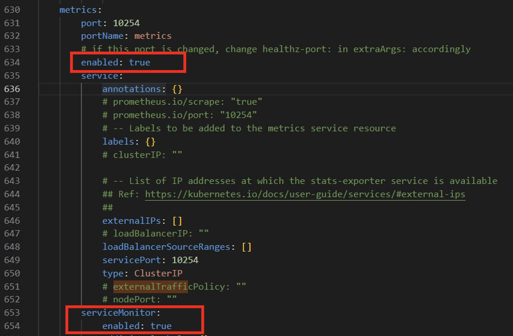
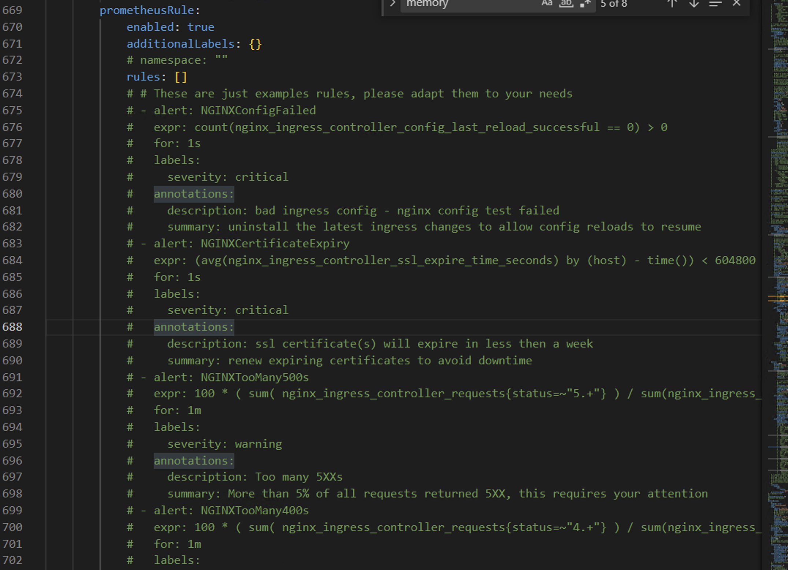
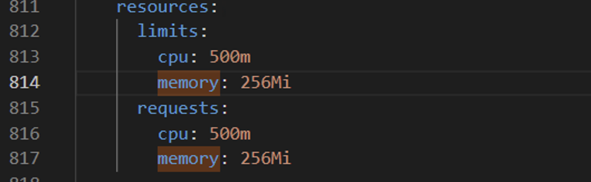

### Nginx Ingress Controller for Production on AKS Hybird
This article presents a comprehensive guide to installing a production-grade Nginx ingress controller. The focus is on various installation methods that are available for deployment in different environments. The article also covers aspects such as autoscaling, monitoring, and auto-scaling to enable a robust and scalable infrastructure for serving web traffic. The article also explores the use of horizontal pod autoscaling and cluster autoscaling to ensure optimal utilization of resources and efficient handling of traffic spikes. Additionally, the article delves into monitoring options using Prometheus and Grafana, and the use of auto-scaling to adjust the infrastructure dynamically based on traffic demands. The information provided in this article is useful for system administrators, developers, and DevOps engineers who are looking to set up a reliable and scalable infrastructure for their web applications.

#### Nginx Ingress Controller, First Decision
A deployment in Kubernetes is a resource object that defines how many replicas of a Pod should be running at any given time. A Pod is the smallest deployable unit in Kubernetes and represents a single instance of a running process. By creating a deployment object, you can ensure that a certain number of Pods are always running, even if some of them fail.

Deployments are useful for managing containerized applications that need to be scaled up or down based on demand. For example, a web application might have more traffic during peak hours, and a deployment can automatically add more replicas to handle the increased load. Conversely, when traffic subsides, the deployment can scale down the number of replicas to save resources.

In Kubernetes, a DaemonSet is a resource object that ensures that a specific pod runs on every node in a cluster. It is designed to run a copy of a pod on each node in a cluster, which makes it useful for running system daemons or other processes that need to be present on every node.

A DaemonSet is similar to a Deployment in that it manages the lifecycle of a set of pods. However, unlike Deployments, DaemonSets are typically used to run system-level services or daemons that need to be running on every node in a cluster.

Installing the Nginx ingress controller as a DaemonSet is considered more performance efficient compared to a Deployment in Kubernetes for several reasons.

A DaemonSet ensures that the Nginx ingress controller pod is running on every node in a cluster, whereas a Deployment only guarantees that the desired number of replicas are running. This means that with a DaemonSet, the Nginx ingress controller is distributed evenly across all nodes in the cluster, allowing for faster and more efficient load balancing.

#### Nginx Ingress Controller, Enabling Monitoring
Monitoring the Nginx ingress controller is important for several reasons:

Ensuring availability: The Nginx ingress controller is responsible for routing traffic to your backend services. If the Nginx ingress controller is not available, traffic will not be able to reach your services, resulting in downtime and potentially lost revenue or other negative impacts. By monitoring the Nginx ingress controller, you can quickly identify any issues and take action to ensure that it remains available.

Performance optimization: Monitoring the Nginx ingress controller can help you identify performance issues and optimize your configuration to improve response times and reduce latency. By monitoring key metrics such as request rates, response times, and error rates, you can gain insight into how the Nginx ingress controller is performing and make informed decisions about how to optimize your configuration.

Capacity planning: Monitoring the Nginx ingress controller can help you plan for future capacity requirements by providing insight into traffic patterns and usage trends. By monitoring key metrics such as request rates and resource utilization, you can identify when you may need to scale up or down your infrastructure to ensure that you can handle increasing traffic volumes.

Overall, monitoring the Nginx ingress controller is critical for ensuring availability, optimizing performance,  and planning for future capacity requirements. By using monitoring tools and techniques to gain insight into the health and performance of your Nginx ingress controller, you can ensure that your infrastructure remains reliable, performant

The ServiceMonitor object in the Prometheus Operator is a Kubernetes resource that is used to configure Prometheus to scrape metrics from a specific set of services in your Kubernetes cluster.

When you create a ServiceMonitor object, you specify a set of labels that define which services should be monitored, as well as a set of endpoints that Prometheus should scrape to collect metrics. The ServiceMonitor object also includes a set of rules that define how the metrics should be collected, including the scrape interval and timeout.

The ServiceMonitor object is used in conjunction with the Prometheus Operator, which is a tool that simplifies the process of deploying and managing Prometheus instances in Kubernetes. When you create a ServiceMonitor object, the Prometheus Operator automatically creates a corresponding set of Prometheus configuration files that specify how to scrape metrics from the specified services.

The ServiceMonitor object is particularly useful for monitoring microservices and other distributed applications that are deployed in Kubernetes. By using labels to define which services to monitor, you can easily configure Prometheus to collect metrics from all instances of a particular service, regardless of how many replicas are running or which nodes they are running on. This can help ensure that you have comprehensive visibility into the performance of your application, even as it scales and evolves over time.

In summary, the ServiceMonitor object is a key component of the Prometheus Operator that enables you to configure Prometheus to monitor specific services in your Kubernetes cluster. By using labels and rules to define which services and endpoints to monitor, you can ensure that you have comprehensive visibility into the performance of your application, regardless of how it is deployed or scaled.

Grafana, a popular open-source visualization tool, by default. When you install the [Prometheus Operator](https://github.com/prometheus-community/helm-charts/tree/main/charts/kube-prometheus-stack) from the official Helm chart repository, Grafana is automatically deployed along with Prometheus, and you can use it to create custom dashboards and visualizations based on the metrics collected by Prometheus.

However, if you are using the AKS Hybrid Monitoring solution from [AKS Hybrid Monitoring](https://learn.microsoft.com/en-us/azure/aks/hybrid/monitor-logging) to deploy the Prometheus Operator, you will need to install Grafana separately. This is because AKS Hybrid Monitoring is a custom implementation of the Prometheus Operator that is optimized for use with AKS Hybrid, and it does not include Grafana by default.

To install Grafana in this scenario, you can use the Grafana Helm chart and configure it to connect to the Prometheus instance deployed by the Prometheus Operator. This will enable you to visualize and analyze the Kubernetes metrics collected by Prometheus, and gain valuable insights into the performance and health of your cluster.

To visualize [nginx ingress controller metrics](https://grafana.com/grafana/dashboards/9614-nginx-ingress-controller/), we need deploy as a configmap in order to make grafana load as a dashboard

PrometheusAlert Manager is a component of Prometheus, an open-source monitoring and alerting system that is widely used in Kubernetes environments. It enables the system to monitor and alert administrators to potential issues with the Nginx Ingress Controller and other workloads running in the Kubernetes cluster.

PrometheusAlert Manager is necessary for the Nginx Ingress Controller because it enables the system to detect and respond to issues that may affect the performance and availability of the Nginx Ingress Controller. It can detect issues such as high CPU usage, memory pressure, or network connectivity problems, which could cause the Nginx Ingress Controller to become unresponsive or perform poorly.

PrometheusRule is a custom resource definition (CRD) provided by Prometheus, an open-source monitoring and alerting system that is widely used in Kubernetes environments. PrometheusRule allows you to define rules for how to collect and process metrics, as well as how to generate alerts based on those metrics.

PrometheusRule CRD provides a way to manage the collection and processing of metrics within a Prometheus instance, enabling administrators to define specific rules for how to handle different types of data. For example, PrometheusRule can be used to define how to scrape and process metrics from a specific application or service, or to aggregate data from multiple sources. Nginx Ingress Controller helm chart gives you to configure these rules. In the picture below,  uncomment all of the rules. 

#### Nginx Ingress Controller Memory Request,Limit  and Cpu Request
Kubernetes provides memory request and limit settings to control the amount of memory allocated to a container. Memory requests indicate the amount of memory a container requests from the system, while memory limits specify the maximum amount of memory a container can use.

It is best practice to set memory requests and limits to the same value. Doing so guarantees that the container has the required amount of memory available and can operate effectively, avoiding performance issues or crashes that result from insufficient memory.

Moreover, it is crucial to use QoS classes to prioritize workload scheduling and eviction decisions based on container resource requirements. Kubernetes offers three QoS classes: Guaranteed, Burstable, and BestEffort.

Guaranteed pods ensure that all containers have CPU and memory requests and limits set to the same value. This guarantees that the container has the requested resources available and Kubernetes will prioritize scheduling and evicting Guaranteed pods based on their QoS class.

Burstable pods have CPU and/or memory requests and limits that are not the same value. In contrast, BestEffort pods have no CPU or memory requests or limits defined. Kubernetes uses QoS classes to determine which pods to schedule or evict first based on the QoS class and available resources on the node.

In summary, Kubernetes memory request and limit settings are essential to manage the amount of memory allocated to containers. It is best practice to set memory requests and limits to the same value to ensure effective container operation. Additionally, QoS classes ensure that workloads are scheduled and evicted based on container resource requirements, with Guaranteed pods having the highest priority due to their strict resource requirements.

After analyzing the memory and CPU usage of your Nginx Ingress Controller, it is essential to tune the memory request/limit and CPU request/limit values. Setting these values correctly can improve your cluster's performance and prevent potential issues in the future.

#### Different NodePool????
Creating a separate node pool for the Nginx Ingress Controller depends on your specific use case. It may be a useful strategy in certain situations, but it is not always necessary or recommended.

One reason to create a separate node pool for the Nginx Ingress Controller is to ensure that it runs on dedicated nodes that are not shared with other workloads. This approach can improve the reliability and performance of the Nginx Ingress Controller since it has exclusive access to the resources of the node.

Another reason to create a separate node pool is to isolate the Nginx Ingress Controller from other workloads that may compete for resources. This approach can prevent the Nginx Ingress Controller from being impacted by other workloads' resource-intensive operations, improving its stability and performance.

However, creating a separate node pool for the Nginx Ingress Controller may not always be necessary or recommended. If your cluster has sufficient resources and the Nginx Ingress Controller workload is not resource-intensive, running it on the same node pool as other workloads may not cause any issues.

Additionally, creating a separate node pool for the Nginx Ingress Controller may result in underutilized resources, leading to unnecessary costs. You may be better off optimizing your current node pool and ensuring that the Nginx Ingress Controller has sufficient resources to run optimally.

In summary, creating a separate node pool for the Nginx Ingress Controller can be beneficial in some cases, but it is not always necessary or recommended. It is essential to consider your specific use case, cluster resources, and workload requirements before deciding to create a separate node pool.