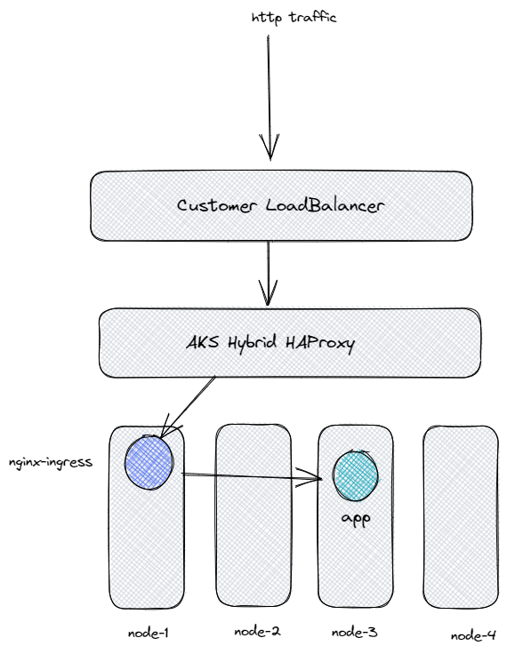
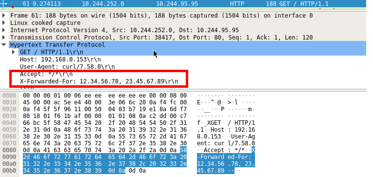
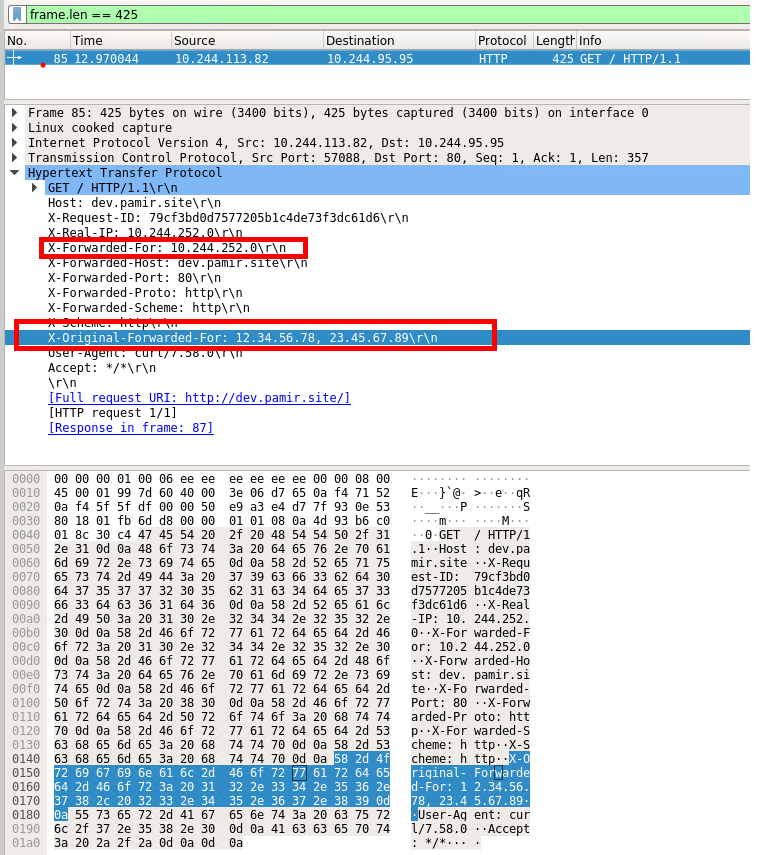

### Ingress Troubleshooting of X-Forwarded-For Header on AKS Hybrid
### What is Ingress Controller
Kubernetes Ingress is a resource object in the Kubernetes API that provides a way to manage external access to services within a Kubernetes cluster. In essence, Ingress is a layer of abstraction that allows you to route traffic to different services based on the URL path or host. It provides a way to expose HTTP and HTTPS routes from outside the cluster to services within the cluster.

In Kubernetes, a Service is used to expose a set of pods as a network service, while an Ingress provides a way to route traffic to those services based on rules that you define. This allows you to create a more fine-grained routing scheme than what is possible with Services alone.

In practical terms, an Ingress resource typically consists of a set of rules that define how traffic should be routed to different backend services based on the URL path or host. The Ingress controller then takes care of implementing these rules by configuring the necessary load balancers, proxies, or other networking components.

Overall, Kubernetes Ingress provides a powerful and flexible way to manage external access to services in a Kubernetes cluster. It enables you to create a unified entry point for your cluster and manage traffic routing in a centralized and scalable way.

### Typical Configuration On-Prem
The following diagram depicts a typical deployment of an Ingress controller and a customer load balancer integrated with the HA Proxy tool. The deployment consists of several components that work together to provide external access to services running in a Kubernetes cluster.

At the core of the deployment is the Ingress controller, which is responsible for managing external traffic and routing it to the appropriate services based on the defined rules. The Ingress controller communicates with the Kubernetes API server to receive updates about the state of the cluster and manages the configuration of the underlying network components

In front of the Ingress controller, a HA proxy load balancer is deployed, which is responsible for distributing incoming traffic across multiple instances of the Ingress controller. This ensures high availability and load balancing for external traffic.

Overall, this deployment architecture provides a robust and scalable solution for managing external traffic and provides high availability and load balancing to ensure that services are always available to users.




We noticed that the Customer LoadBalancer is transmitting the X-Forwarded-For header to HAProxy. However, we are unsure whether HAProxy is discarding the X-Forwarded-For header (we don't believe it would, given that it's a layer 4 load balancer), or if Nginx is discarding the header. To investigate the issue further, we have deployed a sample application to an AKS Hybrid environment.

After deploying our sample application, we deployed a loadbalancer type Kubernetes service. It reserved the IpAddress  192.168.0.153

[deployment.yaml](https://raw.githubusercontent.com/Pamir/kubernetes-essentials/master/04-services/01-frontend-deployment.yaml) </p>
[service.yaml](https://raw.githubusercontent.com/Pamir/kubernetes-essentials/master/04-services/05-frontend-svc.yaml)

```
kubectl get svc
NAME         TYPE           CLUSTER-IP     EXTERNAL-IP     PORT(S)        AGE
frontend     LoadBalancer   10.109.3.246   192.168.0.153   80:30031/TCP   3d1h
kubernetes   ClusterIP      10.96.0.1      <none>          443/TCP        4d16h
```

We now have everything set up to proceed with our testing. In order to capture network traffic between pods, we utilized the 'krews sniff' plugin.
And sent this a simple request to or sample application using loadbalancer ip.
```bash
 kubectl get pods
 ```
 ```
kubectl get pods
NAME                                READY   STATUS    RESTARTS      AGE
frontend-5775b774fb-jll8k           1/1     Running   1 (11h ago)   3d1h
 ```
 ```
#on another terminal
kubectl sniff frontend-5775b774fb-jll8k
curl -XGET -H "X-Forwarded-For: 12.34.56.78, 23.45.67.89"  http://192.168.0.153/
```



Upon analyzing the traffic in Wireshark, it is evident that the X-Forwarded-For header is being transmitted through HAProxy
After conducting this test, our focus turned to the Nginx Ingress Controller as a possible culprit. We installed the Nginx Ingress Controller and set up an ingress to test it. For the purpose of testing and experimentation, it is sufficient to install the Nginx Ingress controller through the GitHub repository. The Nginx Ingress controller is a widely used and popular Ingress controller that provides a simple and effective way to manage external access to services in a Kubernetes cluster.

Installing the Nginx Ingress controller through the GitHub repository involves downloading and configuring the necessary components, including the Ingress controller and any required dependencies. This can be done using a variety of deployment tools, such as Helm, Kubectl, or Kustomize, depending on your specific needs and preferences.

While the Nginx Ingress controller is a relatively simple solution compared to other more complex Ingress controllers, it provides a solid foundation for managing external traffic and can be easily customized to meet the specific needs of your application. It is also well-documented and widely supported, making it a good choice for testing and experimentation in a Kubernetes environment.

```bash
git clone https://github.com/kubernetes/ingress-nginx.git
cd ingress-nginx/charts/ingress-nginx/
kubectl create namespace nginx-ingress
helm install nginx-ingress . -f values.yaml --namespace nginx-ingress
```
```
kubectl get svc -n nginx-ingress
NAME                                              TYPE           CLUSTER-IP      EXTERNAL-IP     PORT(S)                      AGE
nginx-ingrss-ingress-nginx-controller             LoadBalancer   10.99.237.240   192.168.0.154   80:32637/TCP,443:30178/TCP   3d1h
nginx-ingrss-ingress-nginx-controller-admission   ClusterIP      10.109.232.48   <none>          443/TCP                      3d1h
```
```yaml
apiVersion: networking.k8s.io/v1
kind: Ingress
metadata:
  kubernetes.io/ingress.class: nginx
  nginx.ingress.kubernetes.io/configuration-snippet: |
    more_set_headers "X-Forwarded-For $http_x_forwarded_for";
    nginx.ingress.kubernetes.io/rewrite-target: /
  name: minimal-ingress
  namespace: default
spec:
  rules:
  - host: dev.pamir.site
    http:
      paths:
      - backend:
          service:
            name: frontend
            port:
              number: 80
        path: /
        pathType: Prefix
```

To test this, we once again sent a request to the Load Balancer, but this time we used the IP address of the Nginx Ingress load balancer, which is 192.168.0.154

```bash
 curl -XGET -H "X-Forwarded-For: 12.34.56.78, 23.45.67.89"  -H "Host: dev.pamir.site" http://192.168.0.154
```
The Wireshark output of our HTTP GET command is shown in the picture below. As you can see, Nginx is replacing its own X-Forwarded-For header with the Calico IP address and moving our X-Forwarded-For header to the X-Original-Forwarded-For header.



Of course, after a bit of searching online, we found a GitHub issue and a fix that addressed this problem with our customer. You can find the link to the issue and fix here: https://github.com/kubernetes/ingress-nginx/issues/5970#issuecomment-879855750 We applied the fix and the issue was resolved as expected. 
