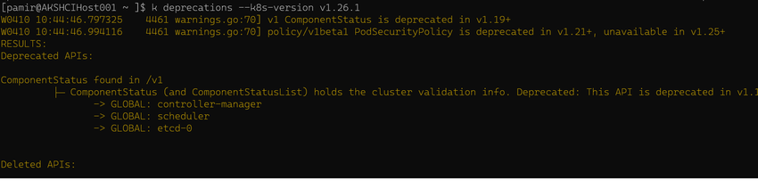
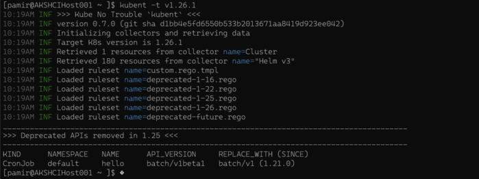
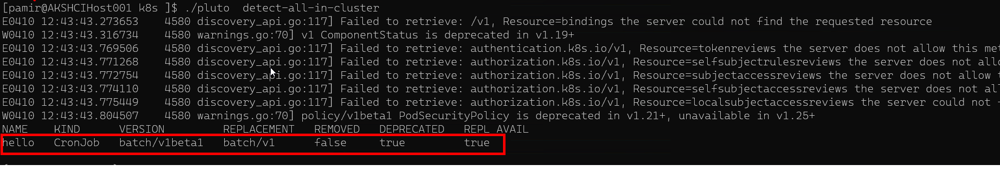
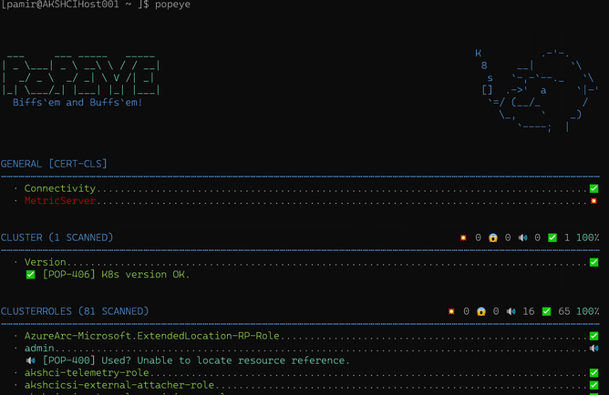

# Achieving Zero Downtime Kubernetes Upgrades in AKS Hybrid on Stack HCI with Probes, PodDisruptionBudget,kube-no-trouble,Popeye, Deprecations Plugin

## Introduction

Upgrading Kubernetes clusters is a critical part of maintaining a healthy and secure environment. However, achieving zero downtime during the upgrade process can be challenging. In this blog post, we will discuss how to perform zero downtime Kubernetes upgrades in an Azure Kubernetes Service (AKS) Hybrid environment on Azure Stack HCI, using liveness, readiness, and startup probes, PodDisruptionBudget, and the deprecations plugin. We will also provide sample use case scenarios for a multi-pod deployment and explain how to add a shutdown hook for graceful pod termination. Additionally, we will show how to handle shutdown signals within Java and .NET Core applications.

## 1. Preparing for the Upgrade

Before beginning the upgrade process, it's crucial to prepare your cluster by addressing any potential issues, including deprecated APIs, resource misconfigurations, and application dependencies. Here's what you need to do:

   a. Install the `deprecations` plugin for Krew, then run it to identify deprecated APIs in your cluster resources. Update the affected resources as recommended by the plugin.
   - Krew is a plugin manager for `kubectl` that makes it easy to discover and manage additional `kubectl` plugins. Follow the official installation instructions for Krew: [Install Krew](https://krew.sigs.k8s.io/docs/user-guide/setup/install/)
   - Install deprecations plugin
   ```bash
   kubectl krew install deprecations
   ```
  - After installing the deprecations plugin, verify that it's working correctly by running the following command:
  ```bash
  kubectl deprecations --help
  ```
  
   b.  kube-no-trouble, also known as kubent, is a command-line utility designed to facilitate the identification of deprecated Kubernetes API versions and resource configurations within a cluster. This tool proves particularly valuable when preparing for a Kubernetes upgrade, as it enables users to verify the compatibility of their resources with the updated version prior to initiating the upgrade process.Kube-no-trouble conducts a comprehensive scan of the Kubernetes cluster, examining resources delineated in manifests, Helm charts, or Kustomize directories. Subsequently, it generates a report highlighting any deprecated APIs or configurations discovered during the scan. Utilizing this report, users can update their resources to align with the most recent supported APIs and configurations, thereby ensuring a seamless upgrade experience. By employing kube-no-trouble, users can proactively detect and address potential complications before they manifest as disruptions to their applications. This helps to maintain stability and availability throughout the upgrade process. The kube-no-trouble GitHub repository can be accessed here: https://github.com/doitintl/kube-no-trouble.

   In the following illustration, it becomes evident that the CronJob API version is outdated, potentially resulting in complications following an upgrade. The API version ought to be updated from `batch/v1beta1` to `batch/v1` to ensure compatibility and prevent potential issues after upgrading the Kubernetes cluster.

  

   c. Pluto is a command-line utility engineered to detect deprecated API versions present in Kubernetes manifests and Helm charts. Its primary purpose is to assist users in identifying APIs requiring updates before executing a Kubernetes upgrade, thus ensuring smooth transitions and maintaining system stability.By utilizing Pluto, users can systematically analyze their Kubernetes configuration files and identify deprecated APIs that may cause compatibility issues or hinder optimal performance after an upgrade. The tool is particularly valuable in large-scale and complex environments where manual inspection may prove cumbersome or ineffective.Pluto operates by parsing Kubernetes manifests and Helm charts, comparing the identified APIs against a list of known deprecated APIs. Upon completion, the utility generates a comprehensive report that highlights the deprecated APIs detected during the scan, along with information on the recommended API versions for replacement.
     

Leveraging Pluto in a Kubernetes environment provides users with a proactive approach to managing deprecated APIs and maintaining cluster compatibility, ultimately promoting maintainability, performance, and security.

The Pluto GitHub repository can be accessed via the following link: https://github.com/FairwindsOps/pluto.
 
   d. Kubernetes Popeye, often referred to as simply Popeye, is an open-source, command-line utility designed to systematically analyze a Kubernetes cluster to identify potential issues and offer recommendations based on best practices. The primary objective of Popeye is to aid users in optimizing their cluster's performance, maintainability, and security.Popeye examines the live state of a cluster by connecting to the Kubernetes API, subsequently evaluating the configuration of various resources such as deployments, services, and pods. Upon completion of this analysis, it generates a comprehensive report highlighting areas in need of improvement. These may include unused or under-utilized resources, misconfigurations, and security vulnerabilities. By employing Popeye, users can gain valuable insights into their Kubernetes cluster's health, allowing them to identify areas for optimization. This, in turn, ensures that their cluster remains performant, maintainable, and secure.
   The Popeye GitHub repository can be accessed via the following link: https://github.com/derailed/popeye.

  

  
   e. Review your application deployments to ensure that they use appropriate liveness, readiness, and startup probes for each container.
   - **Liveness Probe:** The liveness probe checks if your container is running and functioning correctly. If the liveness probe fails, Kubernetes will restart the container. Liveness probes help to ensure that unresponsive or deadlocked containers are automatically recovered. You can configure liveness probes using HTTP GET, TCP socket, or executing a command within the container.
   - **Readiness Probe:** The readiness probe determines if your container is ready to accept incoming traffic. If a container's readiness probe fails, the container will be removed from the load balancer's list of available endpoints until it passes the readiness check again. This ensures that only healthy containers receive traffic, improving overall application stability. Readiness probes can also be configured using HTTP GET, TCP socket, or executing a command within the container.
   - **Startup Probe:** The startup probe verifies that your container has started successfully and is ready to accept traffic. Startup probes are useful for applications with slow startup times, as they prevent Kubernetes from prematurely killing containers that might just be taking longer to start. Like liveness and readiness probes, startup probes can be configured using HTTP GET, TCP socket, or executing a command within the container.
   
   e. **PodDisruptionBudget** is a configuration that allows you to specify the minimum number of available replicas your application should maintain during voluntary disruptions, such as node upgrades or maintenance. By defining a PDB, you can prevent Kubernetes from evicting too many pods at once, which would cause downtime or reduced performance. PDBs help maintain high availability and ensure that your applications remain resilient during upgrades and other planned disruptions.Configure a PodDisruptionBudget (PDB) for your applications to limit the number of concurrently disrupted pods during the upgrade process, ensuring high availability.

## 2. Configuring Probes, Shutdown Hooks, nodeAntiAffinity, and PodDisruptionBudget

To ensure that your applications remain healthy and available during the upgrade process, configure liveness, readiness, and startup probes, as well as a pre-shutdown hook for graceful pod termination. Additionally, set up a PodDisruptionBudget to maintain high availability.


Example YAML file with probes, a pre-shutdown hook, and a PodDisruptionBudget:

```yaml
apiVersion: apps/v1
kind: Deployment
metadata:
  name: nginx-deployment
spec:
  replicas: 3
  selector:
    matchLabels:
      app: nginx
  template:
    metadata:
      labels:
        app: nginx
    spec:
      containers:
      - name: nginx
        image: nginx:1.21
        ports:
        - containerPort: 80
        livenessProbe:
          httpGet:
            path: /
            port: 80
          initialDelaySeconds: 5
          periodSeconds: 5
        readinessProbe:
          httpGet:
            path: /
            port: 80
          initialDelaySeconds: 5
          periodSeconds: 5
        startupProbe:
          httpGet:
            path: /
            port: 80
          failureThreshold: 30
          periodSeconds: 10
        lifecycle:
          preStop:
            exec:
              command: ["sh", "-c", "nginx -s quit; sleep 10"]
      affinity:
        podAntiAffinity:
          preferredDuringSchedulingIgnoredDuringExecution:
          - weight: 100
            podAffinityTerm:
              labelSelector:
                matchExpressions:
                - key: app
                  operator: In
                  values:
                  - nginx
              topologyKey: kubernetes.io/hostname

---

apiVersion: policy/v1beta1
kind: PodDisruptionBudget
metadata:
  name: nginx-pdb
spec:
  minAvailable: 2
  selector:
    matchLabels:
      app: nginx

```
within Java and .NET Core Applications

In addition to using pre-shutdown hooks in your Kubernetes deployment, you can also handle shutdown signals within your applications. This allows your applications to perform cleanup tasks, such as gracefully closing connections or releasing resources, before the pod is terminated.

### Java Example

To handle shutdown signals in a Java application, you can use a `Runtime` instance to add a shutdown hook. This shutdown hook will be executed when the application receives a SIGTERM signal. Here's a simple example:

```java
public class GracefulShutdownExample {
    public static void main(String[] args) {
        // Register a shutdown hook
        Runtime.getRuntime().addShutdownHook(new Thread(() -> {
            System.out.println("Received shutdown signal, performing cleanup...");
            // Add your cleanup code here
        }));

        // Run your application logic
        System.out.println("Running application...");
    }
}
```
### .NET Core Example
In a .NET Core application, you can use the AppDomain.CurrentDomain.ProcessExit event to handle shutdown signals. This event will be raised when the application receives a SIGTERM signal. Here's a simple example:
```cs
using System;

namespace GracefulShutdownExample
{
    class Program
    {
        static void Main(string[] args)
        {
            // Register a process exit event handler
            AppDomain.CurrentDomain.ProcessExit += (sender, eventArgs) => {
                Console.WriteLine("Received shutdown signal, performing cleanup...");
                // Add your cleanup code here
            };

            // Run your application logic
            Console.WriteLine("Running application...");
        }
    }
}

```
By handling shutdown signals within your applications, you can ensure that they gracefully terminate during the Kubernetes upgrade process, further enhancing the zero downtime experience.

By using these configurations and handling shutdown signals within your applications, you can ensure that your applications remain available and healthy throughout the upgrade process, achieving zero downtime Kubernetes upgrades in an AKS Hybrid environment on Azure Stack HCI.

## 3. Upgrading the AKS Hybrid Cluster

Upgrade your AKS Hybrid cluster following the [official AKS Hybrid upgrade documentation](https://learn.microsoft.com/en-us/azure/aks/hybrid/upgrade). The upgrade process in AKS Hybrid is designed to be automated, handling tasks such as cordoning and draining nodes without manual intervention.